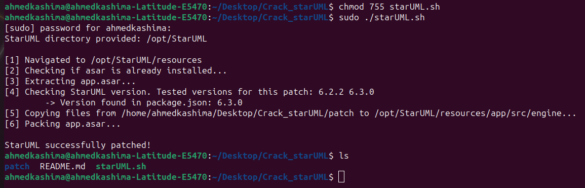

# Crack StarUML | 6.2.2 | 6.3.0

This script is designed to remove license restrictions for **StarUML tested in versions 6.2.2 and 6.3.0**, including the removal of watermarks on exports.

## Prerequisites
1.  **Sudo Permissions**: Required if StarUML is installed in `/opt`.
1. **Node.js**  
3. **Bash**

## Initialization
   ```bash
   git clone git@github.com:kashima1234/Crack_starUML.git
   cd Crack_starUML/
   chmod 755 starUML.sh
```   

## Usage
Run the script with or without specifying the path to the StarUML installation folder, 

 1. **Automatic detection of the StarUML path**:    
	 ```
    sudo ./starUML.sh
	```
2.  **With specified path**:
	  ```
    sudo ./starUML.sh /path/to/StarUML
	```
\
**Output**	




After the script successfully applied, simply restart the StarUML executable to use the patched version.
Or just simply by typing in terminal
 
```
staruml
```